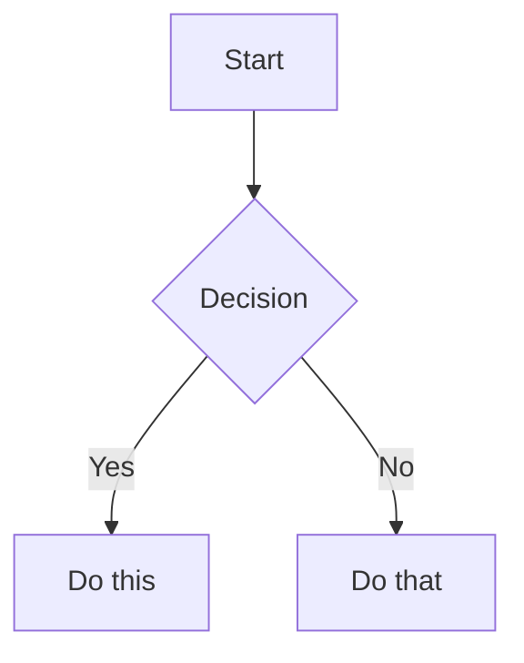

# Obsidian Skill

Comprehensive skill for working with Obsidian vaults. Covers Obsidian Flavored Markdown, Bases, JSON Canvas, and the Obsidian CLI.

## When to Activate

Activate this skill when the user asks to:

- Create or edit Markdown notes in an Obsidian vault
- Use wikilinks, embeds, callouts, properties, or tags
- Create or edit `.base` files (database-like views of notes)
- Create or edit `.canvas` files (visual canvases, mind maps, flowcharts)
- Interact with a running Obsidian instance via the CLI
- Develop or debug Obsidian plugins or themes

## Guidance: Summarizing Code Projects into Obsidian

When asked to summarize or document a codebase into Obsidian notes, focus on information that is **hard to reconstruct from reading code** — things a developer needs to orient themselves but cannot quickly grep for:

**Write into Obsidian (high value):**
- Architecture decisions and rationale (why, not what)
- Module responsibilities and boundaries
- Data flow across services and systems (Kafka topics, API contracts between services)
- Non-obvious relationships and dependencies between modules
- Configuration knobs and their effects (what Apollo keys control what behavior)
- Deployment topology (which starter runs where, scaling strategy)
- Business context that code comments don't capture (what "GoCarty forward" means, why dual-brand exists)
- Gotchas, pitfalls, and tribal knowledge

**Do NOT write into Obsidian (low value — AI can re-read from code):**
- Exhaustive lists of every class, method, or field
- Full database column listings (just note the table name and purpose)
- Complete API request/response schemas (just note the endpoint and what it does)
- Code-level implementation details (interceptor ordering numbers, exact thread pool sizes)
- Information that duplicates what's already in README.md or code comments

The goal is a **navigation map**, not a second copy of the source code. Keep notes concise and link-heavy. A developer reading these notes should know *where to look* and *why things are the way they are*, then go read the actual code.

## Obsidian Flavored Markdown

Obsidian extends CommonMark and GFM with wikilinks, embeds, callouts, properties, comments, and other syntax. Standard Markdown (headings, bold, italic, lists, quotes, code blocks, tables) is assumed knowledge.

### Vault Organization

Focus on **how to use Obsidian features effectively** (links, embeds, properties, bases, canvas, CLI), not on enforcing a fixed vault structure.

- Do **not** require a specific folder taxonomy (for example, `Projects/` + `Global/`)
- Do **not** impose naming conventions unless the user explicitly asks for them
- Adapt file paths and examples to the user's existing vault layout

### Workflow: Creating an Obsidian Note

1. Add frontmatter with properties (title, tags, aliases) at the top of the file. See [PROPERTIES.md](references/PROPERTIES.md).
2. Write content using standard Markdown plus Obsidian-specific syntax below.
3. Link related notes using wikilinks (`[[Note]]`) for internal vault connections, or standard Markdown links for external URLs.
4. Embed content from other notes, images, or PDFs using `![[embed]]` syntax. See [EMBEDS.md](references/EMBEDS.md).
5. Add callouts for highlighted information using `> [!type]` syntax. See [CALLOUTS.md](references/CALLOUTS.md).

> Use `[[wikilinks]]` for notes within the vault (Obsidian tracks renames automatically) and `[text](url)` for external URLs only.

### Internal Links (Wikilinks)

```markdown
[[Note Name]]                          Link to note
[[Note Name|Display Text]]             Custom display text
[[Note Name#Heading]]                  Link to heading
[[Note Name#^block-id]]                Link to block
[[#Heading in same note]]              Same-note heading link
```

Define a block ID by appending `^block-id` to any paragraph:

```markdown
This paragraph can be linked to. ^my-block-id
```

### Embeds

Prefix any wikilink with `!` to embed its content inline:

```markdown
![[Note Name]]                         Embed full note
![[Note Name#Heading]]                 Embed section
![[image.png]]                         Embed image
![[image.png|300]]                     Embed image with width
![[document.pdf#page=3]]               Embed PDF page
```

See [EMBEDS.md](references/EMBEDS.md) for audio, video, search embeds, and external images.

### Callouts

```markdown
> [!note]
> Basic callout.

> [!warning] Custom Title
> Callout with a custom title.

> [!faq]- Collapsed by default
> Foldable callout (- collapsed, + expanded).
```

Common types: `note`, `tip`, `warning`, `info`, `example`, `quote`, `bug`, `danger`, `success`, `failure`, `question`, `abstract`, `todo`.

See [CALLOUTS.md](references/CALLOUTS.md) for the full list with aliases, nesting, and custom CSS callouts.

### Properties (Frontmatter)

```yaml
---
title: My Note
date: 2024-01-15
tags:
  - project
  - active
aliases:
  - Alternative Name
cssclasses:
  - custom-class
---
```

Default properties: `tags` (searchable labels), `aliases` (alternative note names for link suggestions), `cssclasses` (CSS classes for styling).

See [PROPERTIES.md](references/PROPERTIES.md) for all property types and tag syntax rules.

### Tags

```markdown
#tag                    Inline tag
#nested/tag             Nested tag with hierarchy
```

Tags can contain letters, numbers (not first character), underscores, hyphens, and forward slashes.

### Comments

```markdown
This is visible %%but this is hidden%% text.

%%
This entire block is hidden in reading view.
%%
```

### Obsidian-Specific Formatting

```markdown
==Highlighted text==                   Highlight syntax
```

### Math (LaTeX)

```markdown
Inline: $e^{i\pi} + 1 = 0$

Block:
$$
\frac{a}{b} = c
$$
```

### Diagrams (Mermaid)

````markdown

````

### Footnotes

```markdown
Text with a footnote[^1].

[^1]: Footnote content.

Inline footnote.^[This is inline.]
```

---

## Obsidian Bases

Bases (`.base` files) provide database-like views of notes using YAML.

### Workflow

1. Create a `.base` file with valid YAML content
2. Define `filters` to select which notes appear (by tag, folder, property, or date)
3. Add `formulas` (optional) for computed properties
4. Configure `views` (`table`, `cards`, `list`, or `map`) with `order` specifying which properties to display
5. Validate YAML syntax — common issues: unquoted special characters, mismatched quotes in formulas, referencing `formula.X` without defining `X` in `formulas`

### Schema

```yaml
filters:
  and: []        # All conditions must be true
  or: []         # Any condition can be true
  not: []        # Exclude matching items

formulas:
  formula_name: 'expression'

properties:
  property_name:
    displayName: "Display Name"

summaries:
  custom_summary_name: 'values.mean().round(3)'

views:
  - type: table | cards | list | map
    name: "View Name"
    limit: 10
    groupBy:
      property: property_name
      direction: ASC | DESC
    filters:
      and: []
    order:
      - file.name
      - property_name
      - formula.formula_name
    summaries:
      property_name: Average
```

### Filter Operators

| Operator | Description |
|----------|-------------|
| `==` | equals |
| `!=` | not equal |
| `>`, `<`, `>=`, `<=` | comparison |
| `&&` | logical and |
| `\|\|` | logical or |
| `!` | logical not |

### File Properties

| Property | Type | Description |
|----------|------|-------------|
| `file.name` | String | File name |
| `file.basename` | String | Name without extension |
| `file.path` | String | Full path |
| `file.folder` | String | Parent folder |
| `file.ext` | String | Extension |
| `file.size` | Number | Size in bytes |
| `file.ctime` | Date | Created time |
| `file.mtime` | Date | Modified time |
| `file.tags` | List | All tags |
| `file.links` | List | Internal links |
| `file.backlinks` | List | Files linking to this file |

### Formula Syntax

```yaml
formulas:
  total: "price * quantity"
  status_icon: 'if(done, "✅", "⏳")'
  days_old: '(now() - file.ctime).days'
  days_until_due: 'if(due_date, (date(due_date) - today()).days, "")'
  created: 'file.ctime.format("YYYY-MM-DD")'
```

Duration fields: `.days`, `.hours`, `.minutes`, `.seconds`, `.milliseconds`. Always access a numeric field before calling `.round()`.

### Key Functions

| Function | Description |
|----------|-------------|
| `date(string)` | Parse string to date |
| `now()` | Current date and time |
| `today()` | Current date (time = 00:00:00) |
| `if(cond, true, false?)` | Conditional |
| `duration(string)` | Parse duration string |
| `file(path)` | Get file object |
| `link(path, display?)` | Create a link |

See [FUNCTIONS_REFERENCE.md](references/FUNCTIONS_REFERENCE.md) for the complete reference.

### Default Summary Formulas

`Average`, `Min`, `Max`, `Sum`, `Range`, `Median`, `Stddev` (Number), `Earliest`, `Latest` (Date), `Checked`, `Unchecked` (Boolean), `Empty`, `Filled`, `Unique` (Any).

### Embedding Bases

```markdown
![[MyBase.base]]
![[MyBase.base#View Name]]
```

---

## JSON Canvas

Canvas files (`.canvas`) contain visual nodes and edges following the [JSON Canvas Spec 1.0](https://jsoncanvas.org/spec/1.0/).

### File Structure

```json
{
  "nodes": [],
  "edges": []
}
```

### Node Types

All nodes require: `id` (16-char hex), `type`, `x`, `y`, `width`, `height`. Optional: `color` (preset `"1"`-`"6"` or hex).

| Type | Extra Required Fields |
|------|----------------------|
| `text` | `text` (Markdown string, use `\n` for newlines) |
| `file` | `file` (path within vault), optional `subpath` |
| `link` | `url` (external URL) |
| `group` | optional `label`, `background`, `backgroundStyle` |

### Edges

| Attribute | Required | Description |
|-----------|----------|-------------|
| `id` | Yes | Unique identifier |
| `fromNode` | Yes | Source node ID |
| `toNode` | Yes | Target node ID |
| `fromSide`/`toSide` | No | `top`, `right`, `bottom`, `left` |
| `fromEnd`/`toEnd` | No | `none` or `arrow` (default: `none`/`arrow`) |
| `color` | No | Line color |
| `label` | No | Text label |

### Layout Guidelines

- Coordinates can be negative (canvas extends infinitely)
- `x` increases right, `y` increases down; position is top-left corner
- Space nodes 50-100px apart; leave 20-50px padding inside groups
- Align to grid (multiples of 10 or 20)

### Validation Checklist

1. All `id` values unique across nodes and edges
2. Every `fromNode`/`toNode` references an existing node ID
3. Required fields present for each node type
4. JSON is valid and parseable

See [CANVAS_EXAMPLES.md](references/CANVAS_EXAMPLES.md) for complete examples (mind maps, project boards, flowcharts).

---

## Obsidian CLI

Use the `obsidian` CLI to interact with a running Obsidian instance. Requires Obsidian to be open.

See [CLI_REFERENCE.md](references/CLI_REFERENCE.md) for the complete command reference.
Full docs: https://help.obsidian.md/cli

### Syntax

Parameters take a value with `=`. Quote values with spaces:

```bash
obsidian create name="My Note" content="Hello world"
```

Flags are boolean switches with no value:

```bash
obsidian create name="My Note" silent overwrite
```

### File Targeting

- `file=<name>` — resolves like a wikilink (name only, no path or extension needed)
- `path=<path>` — exact path from vault root
- Without either, the active file is used

### Vault Targeting

Commands target the most recently focused vault by default. Use `vault=<name>` for a specific vault:

```bash
obsidian vault="My Vault" search query="test"
```

### CLI Execution Guidelines

**Always use `timeout` when running `obsidian` commands** to prevent hanging:

```bash
# Good: always set a timeout (e.g., 10 seconds)
obsidian read file="My Note"    # with timeout=10000 on executeBash
```

### Workflow: Creating Notes with Complex Content

**CRITICAL**: The `obsidian create` command's `content=` parameter passes through the shell. Backticks, `$`, `!`, and other shell metacharacters will be interpreted by the shell, corrupting the content.

**AVOID building large shell commands, heredocs, or writing huge content= strings.** They are fragile, hard to debug, and frequently fail. Instead, use the **create + append** approach below.

**Preferred approach — create then append in small chunks:**

1. Create the note with a simple skeleton (no special characters):
   ```bash
   obsidian create name="My Note" path="folder/My Note.md" silent
   ```

2. Append content in small, manageable chunks. Each `obsidian append` call adds one section:
   ```bash
   obsidian append file="My Note" content="## Section 1\nSome plain text here."
   obsidian append file="My Note" content="\n## Section 2\nMore content here."
   ```

3. For content with shell-unsafe characters (backticks, `$`, code blocks), use `fsWrite`/`fsAppend` targeting the vault path directly:
   ```bash
   obsidian vault info=path
   # Returns e.g. /Users/you/Documents/Obsidian Vault
   ```
   Then use `fsWrite` or `fsAppend` with the full vault file path. Obsidian auto-detects file changes.

4. Set properties via CLI. **CRITICAL for list properties (tags, aliases, cssclasses):** you MUST include `type="list"` or the comma-separated value is stored as one single string, not split into individual items:
   ```bash
   # WRONG — creates one tag "project, active" (a single string):
   obsidian property:set name="tags" value="project, active" file="My Note"

   # CORRECT — creates two separate tags ["project", "active"]:
   obsidian property:set name="tags" type="list" value="project, active" file="My Note"

   # Scalar properties don't need type=:
   obsidian property:set name="status" value="active" file="My Note"
   ```

**Key rules:**
- Keep each `obsidian append` call short and simple — one section at a time
- Never put code blocks or backticks in `content=` — use `fsWrite`/`fsAppend` for those sections
- Never build a single giant shell command — break it into multiple small calls
- Always use `timeout` on `obsidian` CLI calls to prevent hanging
- **Always use `type="list"` when setting tags, aliases, or cssclasses** — without it, comma-separated values become a single string

**For simple notes** (no special characters at all), a single `obsidian create` with `content=` is fine:
```bash
obsidian create name="Simple Note" content="# Title\nSome plain text" silent
```

### Common Patterns

```bash
obsidian read file="My Note"
obsidian create name="New Note" content="# Hello" silent
obsidian append file="My Note" content="New line"
obsidian search query="search term" limit=10
obsidian daily:read
obsidian daily:append content="- [ ] New task"
obsidian property:set name="status" value="done" file="My Note"
obsidian tasks daily todo
obsidian tags sort=count counts
obsidian backlinks file="My Note"
obsidian vault info=path              # Get vault filesystem path
obsidian folders                      # List vault folders
obsidian files folder="My Folder"      # List files in a folder
```

Use `--copy` to copy output to clipboard. Use `silent` to prevent files from opening. Use `total` on list commands to get a count.

### Plugin Development

After making code changes to a plugin or theme:

1. Reload the plugin: `obsidian plugin:reload id=my-plugin`
2. Check for errors: `obsidian dev:errors`
3. Verify visually: `obsidian dev:screenshot path=screenshot.png`
4. Check console: `obsidian dev:console level=error`

Additional developer commands:

```bash
obsidian eval code="app.vault.getFiles().length"
obsidian dev:css selector=".workspace-leaf" prop=background-color
obsidian dev:dom selector=".workspace-leaf" text
obsidian dev:mobile on
```

## References

- [Obsidian Flavored Markdown](https://help.obsidian.md/obsidian-flavored-markdown)
- [Internal links](https://help.obsidian.md/links)
- [Embed files](https://help.obsidian.md/embeds)
- [Callouts](https://help.obsidian.md/callouts)
- [Properties](https://help.obsidian.md/properties)
- [Bases Syntax](https://help.obsidian.md/bases/syntax)
- [JSON Canvas Spec 1.0](https://jsoncanvas.org/spec/1.0/)
- [Obsidian CLI](https://help.obsidian.md/cli)
- [CLI Command Reference](references/CLI_REFERENCE.md)
